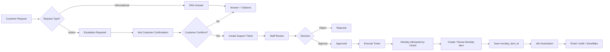

# Harbor — AI Client Support Copilot

Harbor is an end-to-end AI-powered customer support system built as the DevOrbis Capstone Project.

It combines:

- Retrieval-Augmented Generation (RAG)
- AI agents
- Conversation memory
- Human-in-the-loop approval
- Real-time customer/staff communication
- Monday.com integration
- n8n workflow automation
- Supabase authentication and database storage
- A React frontend
- A FastAPI backend

Harbor is designed so that AI can answer normal support questions automatically while sensitive or action-based requests are escalated to a human support agent before external actions are executed.

---

# 1. Project Objective

The goal of Harbor is to demonstrate a realistic AI-powered customer support workflow.

The system supports two major types of requests:

### Informational Requests

Examples:

- What is the refund policy?
- How do I change my password?
- What payment methods are supported?

Harbor answers these requests using the RAG knowledge base and provides citations to the retrieved sources.

### Action Requests

Examples:

- Refund my payment.
- Cancel my subscription.
- I was charged twice.
- Please change something on my account.

These requests are not executed directly by AI.

Instead:

1. Harbor detects that human intervention is required.
2. Harbor asks the customer for confirmation.
3. A support ticket is created.
4. A human support agent reviews the ticket.
5. The support agent approves or rejects the request.
6. Only an approved ticket can be executed.
7. Harbor creates the corresponding item in Monday.com.
8. Harbor sends a downstream event to n8n.
9. n8n handles additional business automation.

This architecture keeps AI assistance useful while maintaining human control over sensitive operations.

---

# 2. Main Features

## AI Support Assistant

Customers can interact with Harbor through a conversational support interface.

The assistant supports:

- Streaming AI responses
- Multi-turn conversations
- Persistent conversation history
- Conversation titles
- Conversation memory
- RAG-based answers
- Source citations
- Escalation detection
- Ticket confirmation

---

## Retrieval-Augmented Generation

Harbor uses a knowledge base to answer support questions.

The RAG pipeline includes:

1. Customer query
2. Input guardrails
3. Query embedding
4. Vector similarity search
5. Relevant knowledge retrieval
6. Context injection
7. LLM answer generation
8. Citation generation
9. Output validation

The embedding model used is:

```text
sentence-transformers/all-MiniLM-L6-v2

The vector database is implemented using Supabase PostgreSQL with pgvector.

3. Conversation Memory

Harbor supports persistent conversation memory.

Two memory strategies are used:

Recent Message Buffer

Recent conversation messages are loaded for short-term context.

Conversation Summary

Long conversations can be compressed into summaries for longer-term context.

Conversation messages are stored permanently in Supabase.

Assistant message metadata also stores information such as:

Citations
Action type
Severity
Escalation status
Ticket ID
Ticket status
Approval status

This allows old conversations to be reopened without losing their AI response metadata or sources.

4. Conversation History

The customer interface includes a ChatGPT-style conversation sidebar.

Features include:

New conversation
Previous conversation history
AI-generated conversation titles
Latest-message previews
Persistent messages
Source citation restoration
Continue previous conversations

Conversation titles are generated automatically from the customer's first message.

Example:

Customer:
I was charged twice and need one payment refunded.

Generated title:
Duplicate Charge Refund
5. Guardrails

Harbor contains input and output guardrails.

Input guardrails determine whether customer content should be:

allow
redact
block
escalate

Sensitive action requests are escalated instead of directly executed.

Harbor separates:

AI reasoning
        ↓
Human approval
        ↓
External execution

This prevents the AI agent from independently performing sensitive actions.

6. Human-in-the-Loop Workflow

Sensitive requests follow this workflow:

Customer request
        ↓
AI identifies action request
        ↓
Customer confirmation
        ↓
Support ticket created
        ↓
Human support agent review
        ↓
Approve / Reject
        ↓
Approved ticket
        ↓
Execute

The external tool cannot be executed unless Harbor has a persisted:

approval_status = approved
7. Ticket Management

Customers can:

View their cases
Open case details
Read staff replies
Reply to support agents

Support agents can:

View all tickets
Filter tickets
Search tickets
View customer information
Approve tickets
Reject tickets
Reply to customers
Add internal notes
Execute approved tickets

Internal staff notes are never shown to customers.

8. Ticket Status Flow

A typical successful ticket moves through:

pending_approval
        ↓
approved
        ↓
executing
        ↓
open

Rejected tickets use:

rejected

Failed execution states can also be tracked.

9. Real-Time Notifications

Harbor uses WebSockets for real-time ticket message notifications.

A WebSocket connection is established after authentication:

/api/v1/ws/notifications
Customer notification

When a support agent sends:

staff_reply

the customer receives the event immediately.

Staff notification

When a customer sends:

customer_reply

support agents receive the event immediately.

Internal notes
internal_note

never generate customer notifications.

The UI includes:

Notification bell
Unread badge
Notification dropdown
Per-ticket unread counts
10. Monday.com Integration

Once a ticket receives human approval, a support agent can execute it.

Harbor performs:

Approved Ticket
      ↓
Atomic Execution Claim
      ↓
Idempotency Lookup
      ↓
Monday.com

Before creating an item, Harbor searches Monday.com using a deterministic idempotency key.

This prevents duplicate external tickets.

Monday.com stores:

Ticket title
Harbor ticket ID
Status
Idempotency key
Description
Severity

After successful execution, Harbor stores:

monday_item_id

in Supabase.

11. Safe Execution / Idempotency

Harbor contains execution protection to prevent duplicate external actions.

The process is:

approved
   ↓
atomic claim
   ↓
executing
   ↓
Monday lookup
   ↓
reuse existing item OR create new item
   ↓
persist monday_item_id

Harbor also supports stale execution-claim recovery.

This is important if the server stops during an external execution.

12. n8n Automation

After Monday.com execution succeeds and Harbor stores the external result, Harbor sends an event to an n8n production webhook.

Example event:

{
  "event_type": "ticket.executed",
  "event_version": "1.0",
  "source": "harbor",
  "ticket_id": "ticket-uuid",
  "monday_item_id": "2861941922",
  "title": "Duplicate charge refund",
  "description": "Customer requested a refund.",
  "severity": "high",
  "status": "open",
  "approval_status": "approved",
  "idempotency_key": "harbor-ticket-..."
}

The n8n workflow performs:

Webhook
   ↓
Validate & Normalize
   ↓
Duplicate Check
   ↓
Priority Routing
   ↓
Email / Notification
   ↓
Audit Logging
   ↓
Snowflake Reporting

n8n is executed after Harbor has safely completed the Monday.com synchronization.

Therefore, an n8n failure does not recreate the Monday.com item.

13. Authentication and Authorization

Authentication is handled using Supabase Auth and Harbor JWT authentication.

Roles:

customer
support_agent

Public registration creates customer accounts.

Protected backend routes validate:

JWT
User existence
Active account status
User role

Role-based authorization ensures customers cannot access staff endpoints.

14. Frontend

The Harbor frontend is built using React.

Main customer interface:

AI Support
My Cases

Customer functionality includes:

AI chat
Conversation history
Streaming responses
Citations
Support cases
Ticket conversations
Real-time notifications

Staff functionality includes:

Operations dashboard
Ticket search
Ticket filtering
Approval workflow
Ticket execution
Customer replies
Internal notes
Notifications
15. Backend

The backend is implemented using FastAPI.

Main responsibilities include:

Authentication
RAG
AI orchestration
Conversation memory
Guardrails
Ticket management
Approval workflow
WebSocket notifications
Monday.com integration
n8n integration
Supabase persistence
16. Technology Stack
Frontend
React
Vite
JavaScript
CSS
Fetch / Axios-style API communication
WebSockets
Server-Sent Events
Backend
Python
FastAPI
Pydantic
Uvicorn
httpx
AI
Groq
LLaMA 3.3 70B
LangChain
LangGraph
Sentence Transformers
RAG
Supabase
PostgreSQL
pgvector
all-MiniLM-L6-v2
Integrations
Monday.com GraphQL API
n8n
Snowflake
Authentication
Supabase Auth
JWT
17. Project Structure
Harbor/
│
├── backend/
│   ├── app/
│   │   ├── agent/
│   │   ├── api/
│   │   ├── core/
│   │   ├── db/
│   │   ├── dependencies/
│   │   ├── guardrails/
│   │   ├── integrations/
│   │   ├── rag/
│   │   ├── realtime/
│   │   ├── repositories/
│   │   ├── services/
│   │   ├── tickets/
│   │   └── main.py
│   │
│   ├── requirements.txt
│   └── .env
│
├── frontend/
│   ├── src/
│   │   ├── api/
│   │   ├── pages/
│   │   ├── realtime/
│   │   ├── styles/
│   │   └── components/
│   │
│   └── package.json
│
└── README.md
18. Environment Variables

Create:

backend/.env

Example:

APP_ENV=development

SUPABASE_URL=
SUPABASE_SERVICE_ROLE_KEY=
SUPABASE_ANON_KEY=

STAFF_EMAIL=

JWT_SECRET_KEY=

GROQ_API_KEY=
GROQ_MODEL=llama-3.3-70b-versatile

MONDAY_API_TOKEN=
MONDAY_BOARD_ID=
MONDAY_GROUP_ID=

MONDAY_HARBOR_TICKET_ID_COLUMN_ID=
MONDAY_STATUS_COLUMN_ID=
MONDAY_IDEMPOTENCY_KEY_COLUMN_ID=
MONDAY_DESCRIPTION_COLUMN_ID=
MONDAY_SEVERITY_COLUMN_ID=

N8N_TICKET_WEBHOOK_URL=
N8N_WEBHOOK_TIMEOUT_SECONDS=8

Never commit the real .env file.

Add:

.env

to .gitignore.

19. Running the Backend

Navigate to:

cd backend

Create a virtual environment:

python -m venv venv

Activate on Windows:

venv\Scripts\activate

Install dependencies:

pip install -r requirements.txt

Run:

uvicorn app.main:app --reload

Backend:

http://127.0.0.1:8000
20. Running the Frontend

Navigate to:

cd frontend

Install dependencies:

npm install

Run:

npm run dev

Frontend:

http://localhost:5173
21. End-to-End Workflow
Customer
   ↓
Harbor AI
   ↓
RAG + Memory + Guardrails
   ↓
Informational?
   ├── Yes
   │     ↓
   │ AI Answer + Citations
   │
   └── No
         ↓
      Escalation
         ↓
Customer Confirmation
         ↓
Support Ticket
         ↓
Staff Review
         ↓
Approve / Reject
         ↓
Approved
         ↓
Execute
         ↓
Monday.com
         ↓
Harbor Persistence
         ↓
n8n Automation
         ↓
Audit / Email / Snowflake
22. Reliability Features

Harbor includes:

Input guardrails
Human approval
Tool authorization
Ticket idempotency
Monday duplicate recovery
Atomic execution claims
Stale claim recovery
WebSocket reconnection
Persistent conversation history
Persistent citations
Role-based authorization
Non-blocking downstream n8n delivery
23. Performance Optimizations

Harbor reuses the trusted Supabase database client so its underlying HTTP connection pool can be reused.

A short-lived authenticated-user cache also reduces repeated profile lookups when multiple API calls occur during page loading.

Conversation sidebar loading uses batched message retrieval rather than issuing one query for every conversation.

24. Current Limitations

The current capstone implementation uses:

In-memory WebSocket connection management
In-memory notification unread state
Background threads for n8n event delivery

These are appropriate for the current single-process capstone deployment.

For a larger production deployment they could be replaced with:

Redis Pub/Sub
Durable notification storage
Celery / Redis / RabbitMQ
Transactional outbox pattern
25. Future Improvements

Potential future enhancements include:

Voice support using Vapi or Retell AI
Persistent notification read state
Redis-based realtime messaging
Advanced analytics dashboard
Durable event queue
Automatic SLA monitoring
More business integrations
Ticket assignment
Multi-agent support teams
26. Capstone Requirements
Requirement	Harbor Implementation
RAG Knowledge Base	Supabase pgvector + embeddings
Grounded Answers	RAG context + citations
LangGraph / AI Agent	Agent routing and tools
Memory	Message buffer + persistent summary
Guardrails	Input/output and execution controls
Human-in-the-loop	Staff approval before execution
n8n Automation	Ticket execution workflow
Business Integration	Monday.com
Web Interface	React
Authentication	Supabase + JWT
Real-time Communication	WebSockets
Deployment	To be deployed
27. Project Status

Core Harbor development is complete.

Current status:

AI Assistant            Complete
RAG                     Complete
Conversation Memory     Complete
Conversation History    Complete
Guardrails              Complete
Ticket System           Complete
Human Approval          Complete
Realtime Notifications  Complete
Monday.com              Complete
n8n                     Complete
Frontend                Complete
Backend                 Complete
Deployment              Pending
Author

Muhammad Idrees Ehsan

DevOrbis Capstone Project

AI / ML & Software Engineering


That is strong enough for both GitHub and your capstone evaluator. You can shorten it later, but for a flagship project I would keep the technical detail.

---

# 2. Harbor Architecture Diagram

For the README, the easiest professional solution is **Mermaid** because GitHub renders it directly.

Add this section to the README:

````markdown
## System Architecture

```mermaid
flowchart TB

    Customer["Customer"]
    Staff["Support Agent"]

    subgraph Frontend["React Frontend"]
        Chat["AI Support Chat"]
        Cases["My Cases"]
        StaffUI["Staff Dashboard"]
        Bell["Realtime Notifications"]
    end

    subgraph Backend["FastAPI Backend"]
        Auth["Authentication & RBAC"]
        Agent["AI Agent / LangGraph"]
        Guardrails["Guardrails"]
        Memory["Conversation Memory"]
        RAG["RAG Pipeline"]
        TicketService["Ticket Service"]
        Approval["Human Approval Layer"]
        Execution["Execution Service"]
        WS["WebSocket Manager"]
    end

    subgraph AI["AI Layer"]
        Groq["Groq / LLaMA 3.3 70B"]
        Embeddings["all-MiniLM-L6-v2"]
    end

    subgraph Supabase["Supabase"]
        Users["Users"]
        Conversations["Conversations"]
        Messages["Messages"]
        Summaries["Conversation Summaries"]
        Tickets["Support Tickets"]
        Updates["Ticket Updates"]
        VectorDB["PostgreSQL + pgvector"]
    end

    subgraph External["External Business Systems"]
        Monday["Monday.com"]
        N8N["n8n Automation"]
        Email["Email / Notifications"]
        Snowflake["Snowflake"]
        Audit["Audit Logging"]
    end

    Customer --> Chat
    Customer --> Cases
    Staff --> StaffUI

    Chat --> Auth
    Cases --> Auth
    StaffUI --> Auth

    Auth --> Users

    Chat --> Agent

    Agent --> Guardrails
    Guardrails --> Memory
    Memory --> Conversations
    Memory --> Messages
    Memory --> Summaries

    Agent --> RAG
    RAG --> Embeddings
    Embeddings --> VectorDB
    RAG --> Groq
    Agent --> Groq

    Agent --> TicketService
    TicketService --> Tickets

    Cases --> TicketService
    StaffUI --> TicketService

    TicketService --> Updates

    StaffUI --> Approval
    Approval --> Tickets

    Approval --> Execution
    Execution --> Monday

    Monday --> Execution
    Execution --> Tickets

    Execution --> N8N

    N8N --> Email
    N8N --> Audit
    N8N --> Snowflake

    TicketService --> WS
    WS --> Bell
    Bell --> Customer
    Bell --> Staff

### Simplified architecture

For your presentation or viva, use this easier diagram:

```text id="mxr874"
                   ┌───────────────────────┐
                   │       CUSTOMER        │
                   └───────────┬───────────┘
                               │
                               ▼
                 ┌─────────────────────────┐
                 │     REACT FRONTEND      │
                 │                         │
                 │ AI Chat     My Cases    │
                 └─────────────┬───────────┘
                               │
                               ▼
                 ┌─────────────────────────┐
                 │      FASTAPI API        │
                 │                         │
                 │ Auth + RBAC             │
                 │ Guardrails              │
                 │ AI Agent / LangGraph    │
                 │ Ticket Service          │
                 │ WebSockets              │
                 └──────────┬───────┬──────┘
                            │       │
                  ┌─────────┘       └─────────┐
                  ▼                           ▼
       ┌───────────────────┐       ┌──────────────────┐
       │   AI / RAG Layer  │       │     Supabase     │
       │                   │       │                  │
       │ Groq LLM          │       │ Users            │
       │ MiniLM Embeddings │       │ Conversations    │
       │ pgvector Search   │       │ Messages         │
       │ Memory            │       │ Tickets          │
       └─────────┬─────────┘       │ Ticket Updates   │
                 │                 │ pgvector         │
                 └───────┬─────────┴──────────────────┘
                         │
                         ▼
                 ┌────────────────────┐
                 │ HUMAN APPROVAL     │
                 │ Support Agent      │
                 └─────────┬──────────┘
                           │
                         Approve
                           │
                           ▼
                 ┌────────────────────┐
                 │ Execution Service  │
                 │ + Idempotency      │
                 └─────────┬──────────┘
                           │
                           ▼
                 ┌────────────────────┐
                 │     Monday.com     │
                 └─────────┬──────────┘
                           │
                           ▼
                 ┌────────────────────┐
                 │        n8n         │
                 └─────┬─────┬───────┘
                       │     │
                  ┌────┘     └──────┐
                  ▼                 ▼
              Email/Audit       Snowflake
```

And the **business workflow diagram**, which is particularly useful during your capstone demonstration:


